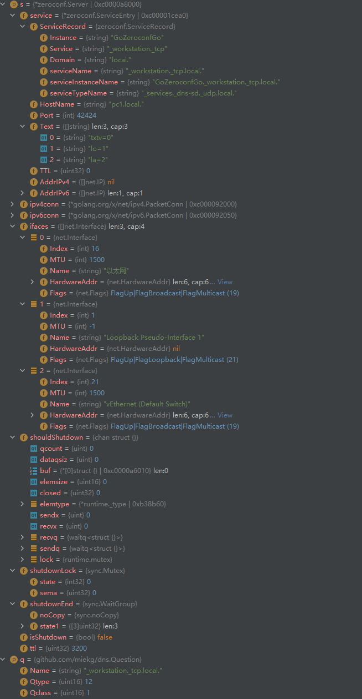
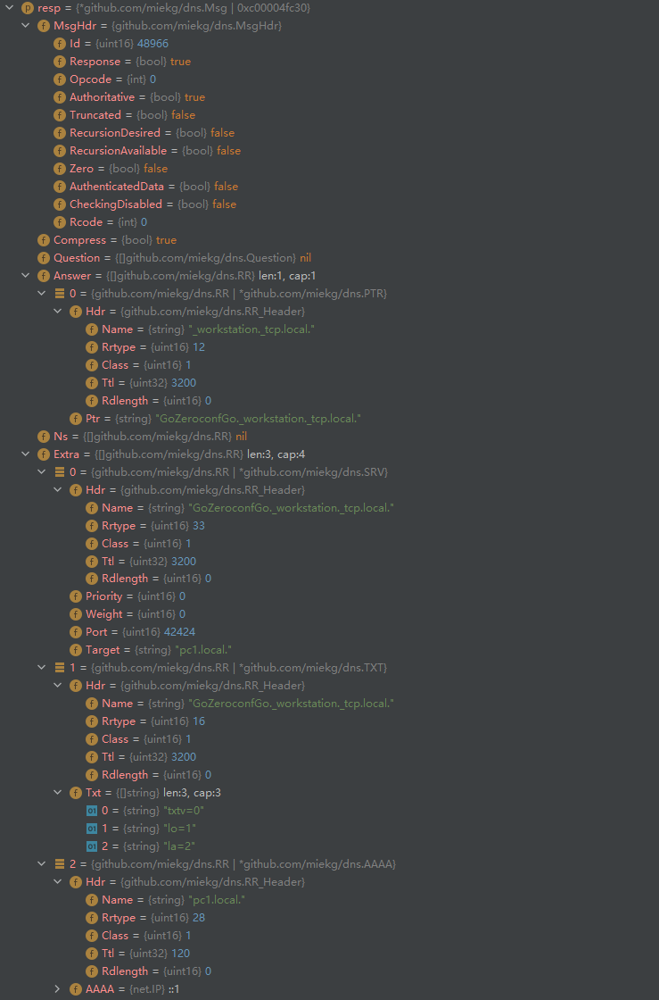
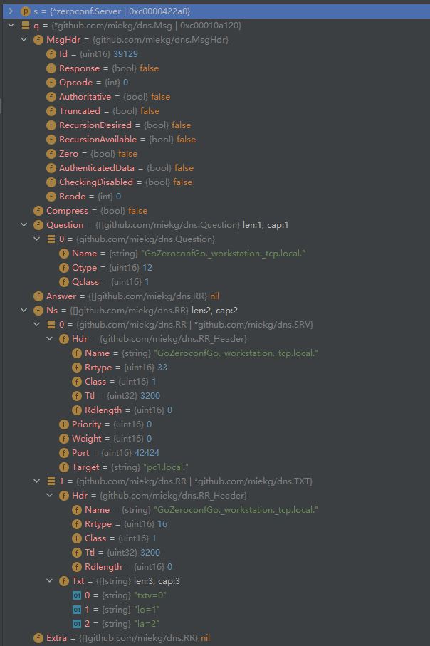
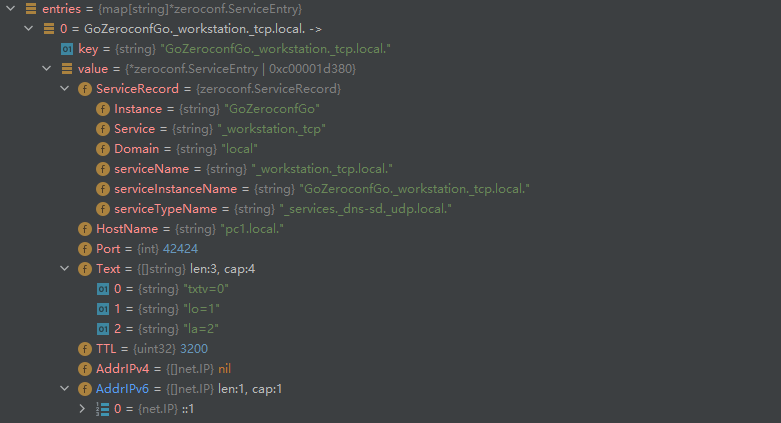

server、client 是服务注册于发现时 应用的角色；并且两者都可以作为dns消息的发送、接受端

整体可以理解为 ：   通过dns协议， 获取对应服务其中一台节点的hostname、port

### Server

<font color="red">（接收消息依靠mainloop协程;发送消息probe依靠协程）</font>

启动后会初始化



### probe step 1

<font color="red">`服务启动后主动发送的消息 示例`</font>

``````
;; opcode: QUERY, status: NOERROR, id: 4352
;; flags:; QUERY: 1, ANSWER: 0, AUTHORITY: 2, ADDITIONAL: 0

;; QUESTION SECTION:
;GoZeroconfGo._workstation._tcp.local.	IN	 PTR

;; AUTHORITY SECTION:
GoZeroconfGo._workstation._tcp.local.	3200	IN	SRV	0 0 42424 pc1.local.
GoZeroconfGo._workstation._tcp.local.	3200	IN	TXT	"txtv=0" "lo=1" "la=2"
``````


```
假设有3个适配器

# 启动流程
-	1、构建ipv4连接、ipv6连接
-	2、multicastResponse(ifindex=0)
-	3、重复2次，依次向ipv4、ipv6连接 发送相同的dns.Msg 数据包;
-	4、会收到 重试2次 * 3个适配器 * （每个适配器的ipv4、ipv6）次数据，但是此时并不会对数据进行Query
-	5、判断逻辑 len(query.NS)>0   （实际收到了SRV、TXT）；  不会有结果返回

```

### probe step 2 

<font color="red">`服务启动后主动发送的消息 示例`</font>

``````
;; opcode: QUERY, status: NOERROR, id: 0
;; flags: qr; QUERY: 0, ANSWER: 5, AUTHORITY: 0, ADDITIONAL: 0

;; ANSWER SECTION:
GoZeroconfGo._workstation._tcp.local.	3200	CLASS32769	SRV	0 0 42424 pc1.local.
GoZeroconfGo._workstation._tcp.local.	3200	CLASS32769	TXT	"txtv=0" "lo=1" "la=2"
_workstation._tcp.local.	3200	IN	PTR	GoZeroconfGo._workstation._tcp.local.
_services._dns-sd._udp.local.	3200	IN	PTR	_workstation._tcp.local.
pc1.local.	120	CLASS32769	AAAA	::1
``````


-	1、发送消息（上面的示例）
		multicastResponse(ifindex=适配器的net.interface.Index)
		重试2次 * 3个适配器 * （每个适配器的ipv4、ipv6）
	
-	2、接收消息
		没有;; QUESTION SECTION:不会调用	handleQuery	函数
	
- 3、根据Name进程分支判断

   ``````
   HostName
   serviceTypeName
   serviceInstanceName
   ``````

- 4、将请求信息、server的SRV、TXT等信息封装到响应信息中

- 5、并根据intf.Index 让对应适配器将消息通过ipv4、ipv6协议发送出去

   


### 响应数据包

``````
;; opcode: QUERY, status: NOERROR, id: 33537
;; flags: qr aa; QUERY: 0, ANSWER: 1, AUTHORITY: 0, ADDITIONAL: 3

;; ANSWER SECTION:
_workstation._tcp.local.	3200	IN	PTR	GoZeroconfGo._workstation._tcp.local.

;; ADDITIONAL SECTION:
GoZeroconfGo._workstation._tcp.local.	3200	IN	SRV	0 0 42424 pc1.local.
GoZeroconfGo._workstation._tcp.local.	3200	IN	TXT	"txtv=0" "lo=1" "la=2"
pc1.local.	120	IN	AAAA	::1
``````



``````
id : 16bits 随机数，用于标识消息
``````


# Client

- 1、启动后发包查询所有同一域下的机器(数据包如下)；该数据包会发往 ---->  3个适配器 * （每个适配器的ipv4、ipv6）一般QUESTION SECTION 只有一个;并且server会对每一个Question作出响应

  ``````
  ;; opcode: QUERY, status: NOERROR, id: 6500
  ;; flags:; QUERY: 1, ANSWER: 0, AUTHORITY: 0, ADDITIONAL: 0
  
  ;; QUESTION SECTION:
  ;_workstation._tcp.local.	IN	 PTR
  ``````

  

- 2、go func(){初始化sentEntries = make(map[string]*ServiceEntry)}    

  -  生命周期：

  -  1、先启动该协程，接收符合要求的相应，放入 sentEntries ，并发往  <-chan *zeroconf.ServiceEntry

  -  2、然后发消息

  -  3、终止该协程

  - ``````
    问题：
    	如果在终止前，没有及时收到响应，就不会有响应了
    ``````

- 3、通过chan 接收符合要求的服务端，0个或1个 （由 sentEntries 决定）




